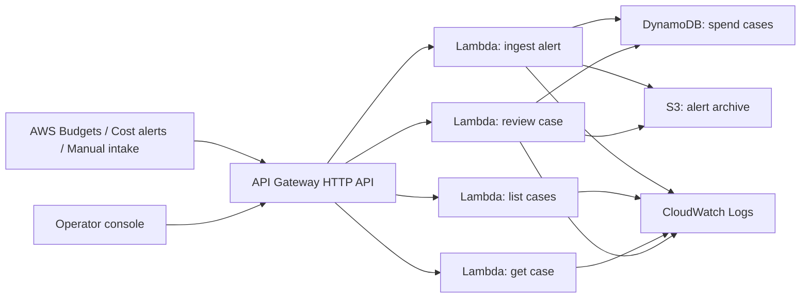

# Architecture

## One-line thesis

`AWS Spend Inbox` is an AWS-native operator console for reviewing unexpected cost alerts and deciding what to inspect first.

## Core user

- startup founders watching the AWS bill directly
- devops or platform engineers
- backend leads who get asked why cloud spend suddenly jumped

## Main pain

- cost alerts arrive, but nobody knows what to look at first
- budgets, anomaly alerts, and optimization recommendations live in different places
- teams need one place to record "we saw this" and "we fixed this"

## AWS architecture



## Resource responsibilities

### API Gateway

- accepts alert ingestion requests
- exposes operator-facing endpoints for list, detail, and review

### Lambda ingest

- accepts an alert payload
- normalizes it into a small spend review case
- stores raw alert payload in `S3`
- stores case metadata in `DynamoDB`

### DynamoDB

Stores case status and review state:

- case identifier
- status
- source
- service
- severity
- estimated impact
- review note and timestamps

### S3

Stores:

- raw alert payloads
- review artifacts

### Operator console

Provides:

- case list
- case detail
- acknowledge and resolve actions
- quick API base configuration

## Data model

### Table: `spend-cases`

- primary key: `caseId`
- global secondary index:
  - partition key: `status`
  - sort key: `receivedAt`

### Typical state transitions

```text
NEW -> ACKNOWLEDGED
NEW -> RESOLVED
ACKNOWLEDGED -> RESOLVED
```

## Honest scope boundary

This scaffold intentionally stops short of:

- live ingestion from actual AWS Cost APIs
- account-wide forecasting
- automated remediation
- multi-account organization rollups
- full auth and RBAC

Those belong in the next iteration, after the review workflow is stable.
