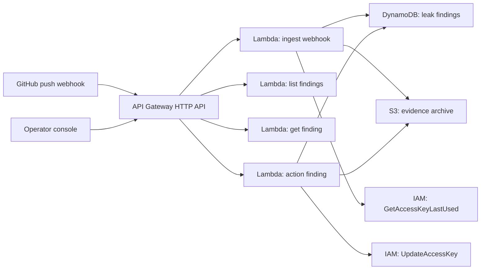

# Architecture

## One-line thesis

`LeakGuard` is an AWS-native response bot for leaked AWS access keys found in GitHub push events.

## Core user

- platform and security-minded backend engineers
- small dev teams without a full secret scanning workflow
- anyone who needs to answer "did we just leak a live AWS key?"

## Main pain

- a leaked key can stay active until someone notices it
- teams lose time searching diffs, logs, and IAM consoles separately
- many tools stop at detection and do not close the loop on AWS credentials

## AWS architecture

## Resource responsibilities

### API Gateway

- receives GitHub webhook calls
- exposes operator-facing endpoints for list, detail, and manual actions

### Lambda ingest

- verifies webhook signature when a shared secret is configured
- fetches or reads diff text
- runs a high-confidence detector for AWS access key IDs
- stores findings in `DynamoDB`
- archives evidence in `S3`
- enriches findings with IAM key metadata when possible

### DynamoDB

Stores:

- finding id
- status
- repository and branch
- redacted key id
- IAM user name
- timestamps
- action counts

### S3

Stores:

- raw webhook payloads
- action audit artifacts

### Action function

- disables an exposed IAM access key on operator request
- records audit state back into `DynamoDB`

## Honest scope boundary

This prototype intentionally does not try to be:

- a full secret scanning platform
- a GitHub Advanced Security replacement
- a multi-provider secret detector
- an automatic remediation engine by default

It focuses on one painful workflow: detect a leaked AWS key and respond fast.
