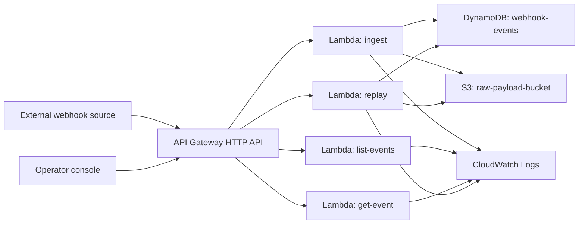

# Architecture

## One-line thesis

`Webhook Replay Console` is an AWS-native operator surface for webhook ingestion, inspection, and replay.

## Core user

- integration engineers
- backend teams maintaining webhook handlers
- operations teams debugging delivery failures

## Main pain

- failed webhooks are hard to inspect
- raw payloads are not easy to recover
- retries happen through ad-hoc scripts
- there is no clean audit trail for manual replay

## AWS architecture



## Resource responsibilities

### API Gateway

- public ingress for webhook sources
- operator-facing endpoints for list, detail, and replay

### Lambda ingest

- accepts webhook payload
- derives metadata such as `source`, `eventType`, and `correlationId`
- stores raw payload in `S3`
- stores event summary in `DynamoDB`

### DynamoDB

Stores event summary and replay state:

- event identifier
- status
- source
- timestamps
- replay count
- error fields
- payload archive key

### S3

Stores:

- raw webhook payloads
- replay artifacts

### Operator console

Provides:

- event list
- event detail
- replay trigger
- quick API base configuration

## Data model

### Table: `webhook-events`

- primary key: `eventId`
- global secondary index:
  - partition key: `status`
  - sort key: `receivedAt`

### Typical state transitions

```text
RECEIVED -> PROCESSED
RECEIVED -> FAILED
FAILED -> REPLAYED
PROCESSED -> REPLAYED
```

## Honest scope boundary

This scaffold intentionally stops short of:

- provider-specific webhook signature verification
- dead-letter queues
- automatic retry policies
- production-grade downstream delivery fan-out
- full auth and RBAC

Those belong in the next iteration, after the operator workflow is stable.
